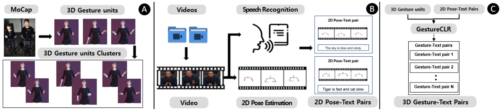
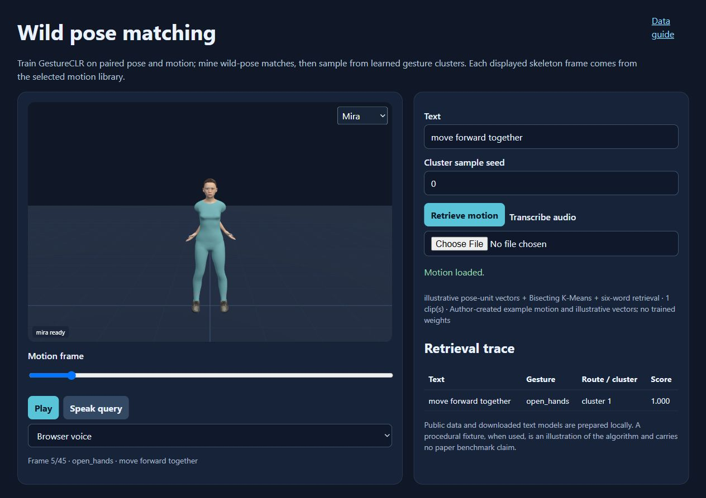

# Improving Co-speech gesture rule-map generation via wild pose matching with gesture units.

**Ghazanfar Ali, Jae-In Hwang**

**SIGGRAPH Asia Posters · 2022** · Published

[Paper / publisher](https://doi.org/10.1145/3550082.3564185) · [Project page](https://ghazanfarali.com/research/wild-pose-matching/) · [Video presentation](https://www.youtube.com/watch?v=QBtGdGE1Wgk) · [BibTeX](citation.bib) · [Requirements](REQUIREMENTS.md) · [Code & setup](#implementation-and-usage)

> Contrastive matching turns noisy video poses into a richer gesture rule map.



*Original method figure from the paper: Figure 1, PDF page 1. Extracted for this research introduction; the diagram describes the original system, not verification of this reimplementation.*

## Why this research

Poses estimated from everyday video are noisy and differ from clean 3D motion capture. A robust matching model can turn those videos into a richer source of gesture rules.

The poster aligns 2D poses from public monologue videos with gesture units extracted from 3D motion capture. GestureCLR learns robust matching; K-Means clusters the units to support variety when retrieving gestures at runtime.

## Method at a glance

**Text + noisy video pose** → **GestureCLR matching** → **Clustered gesture rules**

| | Research system |
|---|---|
| Input | Video-derived text and 2D pose; captured 3D motion |
| Method | Contrastive pose-to-unit matching and K-Means clustering |
| Output | Text-to-gesture rules and clustered gesture units |

## Evidence and scope

Poster demonstrates the expanded gesture library and mapping pipeline

**Attribution:** These findings describe the paper or manuscript, not results obtained with this repository's code.

**Study context:** 2,035 gesture units and 210,000 rules.

**Limitations:** This is a two-page poster; the later multilingual paper contains a separate user study and should be cited for that evidence.

## Explore the implementation

Algorithm 3 gesture-unit extraction, trainable GestureCLR with the paper's noise/shift augmentation, Bisecting K-Means unit clusters, rule mining and six-gram semantic retrieval, with a BEAT route that keeps library, training and wild speakers disjoint. Public motion replaces the private unit library.

This repository contains independently written research code. The institute's original source, datasets and trained models are not distributed. Public-data preparation, commands, assumptions and checks are documented below and in [REQUIREMENTS.md](REQUIREMENTS.md).

## Resources and citation

Read the paper through its [publisher record](https://doi.org/10.1145/3550082.3564185). PDFs are hosted by publishers or preprint archives rather than stored in this repository.

Watch the [existing YouTube presentation](https://www.youtube.com/watch?v=QBtGdGE1Wgk).

Please cite the research paper when using its ideas; [download the BibTeX citation](citation.bib). The implementation has its own documented scope.

<!-- demo-preview:start -->
## Demo preview



*The prepared BEAT sequence shows locally fitted pose matching and retrieval. This preview is not a paper benchmark.*

From the repository root, using the Python environment described below:

```sh
python -m pip install -e .
python -m pip install -r scripts/requirements-demo.txt
python scripts/start_demo.py
```

Open **http://127.0.0.1:8080/**. On first launch, the script downloads one official BEAT BVH and matching TextGrid, prepares nine distinct clips and disjoint paired association windows in ignored `outputs/`, extracts Algorithm 3 gesture units, trains GestureCLR with the paper's augmentation for a short demo step budget, and clusters the unit latents locally. Text matching uses Sentence-BERT all-MiniLM-L6-v2, which the launcher downloads once (about 92 MB) into ignored `models/`; `--offline` skips the download and `BEAT_SBERT_MODEL` or `SBERT_MODEL` selects another local model. Without a model a labelled TF-IDF fallback is used; each response names its text encoder, and text without a match plays an explicit idle slot. Choose a suggested utterance to inspect selected IDs, matched text, route and confidence, then click **Play speech + gesture**. Stop cancels speech, and scrubbing previews a pose. The first launch also downloads pinned Three.js modules. Public recordings and fitted weights remain local.

The 3D presentation uses shared Three.js avatar components and bundled fictional CC0 characters. The paper-specific algorithms and data adapters live in this repository.

**Paper method on BEAT.** When a BEAT source is configured (`BEAT_PROCESSED_ROOT` for a processed collection, `BEAT_RAW_ROOT` for raw `beat_english_v0.2.1` BVH/TextGrid, or a copy under `data/beat/`) and the Sentence-BERT model is available (`models/all-MiniLM-L6-v2`, downloaded on first run, or `BEAT_SBERT_MODEL`/`SBERT_MODEL`), `scripts/start_demo.py` first runs `scripts/prepare_paper_method.py`, which trains or mines with this repository's own pipeline on disjoint BEAT speakers and caches the result under ignored `outputs/paper-method/`. The same viewer then serves that prepared method with its library and suggested queries. Without the data the launcher serves the small demo adapter above; `--skip-paper-method` forces it. See [Reproduce with BEAT](#reproduce-with-beat).

To replace the demo motion with an existing processed BEAT take, run `python scripts/prepare_beat_demo.py --processed /path/to/processed/beat`, then restart the server. Use `--rebuild --epochs 80` to regenerate the public sample and refit the small adapter. For a larger bank, the documented full-data CLI below retains the paper-specific input contracts.

<!-- demo-preview:end -->

## Implementation and usage

<!-- implementation-guide -->

Clean-room educational implementation of *Improving Co-speech gesture rule-map generation via wild pose matching with gesture units* (Ali and Hwang, SIGGRAPH Asia Posters 2022, DOI: [10.1145/3550082.3564185](https://doi.org/10.1145/3550082.3564185)). It implements:
- Algorithm 3 gesture-unit extraction (from the thesis);
- learned noisy-2D/clean-3D matching (GestureCLR) with the paper's augmentation;
- Bisecting K-Means clustering of unit latents;
- rule mining;
- six-gram retrieval. It is independent of the institute implementation.

The default browser path is the prepared BEAT demo above. The older `python scripts/demo_server.py --example` path, when the prepared BEAT cache is absent, remains an offline algorithm fixture with author-created motion and illustrative vectors. It does not fit GestureCLR. The prepared-data commands below retain the full CLI contracts, including a real encoder and checkpoint. [Multilingual Gesture](https://github.com/ghazanPK/multilingual-gesture) later adds translation around English retrieval and refines the motion units; it is a research continuation, not a required dependency here.

```bash
python -m pip install -e .
python scripts/prepare_viewer.py --out static/vendor
python scripts/demo_server.py --example
```

### Reproduce with BEAT

`scripts/prepare_paper_method.py` runs this repository's full pipeline on public [BEAT](https://pantomatrix.github.io/BEAT/) motion, then serves the result in the browser viewer. Disjoint speakers take the paper's three roles:

| Role | Default speakers | Used for |
|---|---|---|
| `library` | 2 | Continuous 3D motion → Algorithm 3 units (`gestureclr extract-units`), clustered with Bisecting K-Means (`gestureclr cluster`) |
| `train` | 2 | 3 s windows: clean 3D plus a 2D projection at a random yaw within ±30° → GestureCLR (`gestureclr train`) |
| `wild` | 2 | Held-out 3 s windows with their transcripts → rules (`gestureclr mine`). The windows are projected through a camera at yaw 20° and pitch 5°, then corrupted like OpenPose tracks: noise, ±1-frame jitter and 5% joint dropout. |

Roles are assigned per speaker with a fixed `--seed`. `--role library=1,2 --role train=0.5 --role wild=rest` overrides them.

**1. Sentence-BERT.** `python scripts/start_demo.py` downloads `all-MiniLM-L6-v2` (about 92 MB) into the ignored `models/all-MiniLM-L6-v2` on first run; the hook itself never downloads. To fetch it without starting the demo:

```bash
python scripts/beat_demo/fetch_models.py
```

`--sbert DIR`, `BEAT_SBERT_MODEL` or `SBERT_MODEL` selects another local copy.

**2a. Processed OmniMo collection.** The collection is laid out as `<root>/<speaker>/{meta.json,motion.npz}`:

```bash
python scripts/prepare_paper_method.py --processed /path/to/processed/beat
python scripts/demo_server.py --prepared outputs/paper-method/<key> --port 8080
```

The last line of standard output is JSON whose `server_args` give the exact prepared folder.

**2b. Raw BEAT from Hugging Face.** Download BVH and TextGrid pairs from the official dataset [`H-Liu1997/BEAT`](https://huggingface.co/datasets/H-Liu1997/BEAT) into `data/beat/beat_english_v0.2.1/<speaker>/`. Each BVH is about 20 MB:

```bash
base=https://huggingface.co/datasets/H-Liu1997/BEAT/resolve/main/beat_english_v0.2.1/beat_english_v0.2.1
for take in 1_wayne_0_1_1 1_wayne_0_2_2 2_scott_0_1_1 2_scott_0_2_2 3_solomon_0_3_3 3_solomon_0_4_4 \
            4_lawrence_0_2_2 4_lawrence_0_3_3 5_stewart_0_1_1 5_stewart_0_2_2 6_carla_0_2_2 6_carla_0_3_3; do
  spk=${take%%_*}; mkdir -p data/beat/beat_english_v0.2.1/$spk
  for ext in bvh TextGrid; do curl -fL -o data/beat/beat_english_v0.2.1/$spk/$take.$ext $base/$spk/$take.$ext; done
done
python scripts/prepare_paper_method.py --beat-root data/beat/beat_english_v0.2.1
```

**Launcher.** `python scripts/start_demo.py` runs this hook after the shared BEAT demo preparation.
- **Source.** It looks in `--processed` or `--beat-root`, then `BEAT_PROCESSED_ROOT` or `BEAT_RAW_ROOT`, then `data/beat/processed` or `data/beat/beat_english_v0.2.1`.
- **Missing input.** Without a source or Sentence-BERT, it prints the next step and the default demo starts unchanged.
- **Cache.** Results are cached in ignored `outputs/paper-method/<settings hash>/`. A repeat launch with the same settings returns at once; `--force` rebuilds.

**Demo scale and paper preset.**
- **Demo (default).** Speakers 1–6, two takes each, `--preset demo`: 300 epochs at batch 64, and about one cluster per four units. On a CPU it takes about two minutes. One local run on the processed collection gave 93 units, 80 training pairs, 88 rules over 23 clusters, and a held-out cross-view top-1 of 0.25 against a chance of 0.011 (88 windows).
- **Paper preset.** `--speakers all --max-takes-per-speaker 0 --preset paper` trains 1000 epochs at batch 512 with 100 clusters.
- **Tuning.** `--epochs`, `--max-steps`, `--clusters` and `--variance-percentile` adjust either.

**Viewer.** `/api/beat-library` lists the library units and the stored metrics. Its suggested queries include rule phrases and held-out probes; the probes are library-speaker transcripts that never became rules. `/api/beat-query` returns, for each six-word chunk, the unit frames, cluster, route and score. The route is `learned_pose_rule`, or `idle_no_match` below the 0.2 similarity floor (`min_similarity`).

**Limits.** Projected BEAT motion stands in for wild video and OpenPose output; it is not the paper's data. The held-out metric checks whether a corrupted 2D window finds its own 3D window among the held-out windows; it is not a paper benchmark. A demo-scale rule map covers only a few thousand transcript words.

### Install and data

```bash
python -m venv .venv
source .venv/bin/activate
python -m pip install -e . pytest
```

On Windows PowerShell, activate with `.\.venv\Scripts\Activate.ps1` instead of the `source` line.

Verify the complete local path with generated arrays:

```bash
python scripts/verify.py
```

The command writes two procedural 11-joint motion takes, a held-out projected "wild" set with text, and a local 384-D SentenceTransformer fixture. It then runs the installed CLI into `outputs/verification/`: `extract-units`, a short `train`, `cluster`, `mine`, and `retrieve --audio-seconds --min-similarity`. The local encoder replaces only the downloadable Sentence-BERT weights. Real runs use `all-MiniLM-L6-v2` instead; pose/motion shapes, checkpoints, clustering, and retrieval are identical. The short training budget only checks the plumbing.

**Sentence-BERT acquisition.** `mine` and `retrieve` take `--sbert NAME_OR_DIR` (default `all-MiniLM-L6-v2`). A hub name is downloaded once into the Hugging Face cache on first use. To work offline, save a local copy and pass its directory, optionally with `--sbert-local-only`, which never downloads:

```bash
python scripts/beat_demo/fetch_models.py   # the same pinned copy start_demo.py downloads
gestureclr mine ... --sbert models/all-MiniLM-L6-v2 --sbert-local-only
```

Users prepare all data. [Talking With Hands 16.2M](https://github.com/facebookresearch/TalkingWithHands32M) is the public training source cited by the paper; follow its access terms and derive synchronized 2–3 second paired units. For wild records, use videos you may process and produce timestamped text plus 2D pose; the [TED Gesture Dataset](https://github.com/youngwoo-yoon/Co-Speech_Gesture_Generation) is a practical public replacement. No dataset, videos, motion, weights, or claimed 2,035-unit/210k-rule artifact is included.

### Prepare data and launch the motion demo

`scripts/prepare_public_data.py` accepts a licensed BVH and word-aligned JSONL transcript. Supply either one record with `words` or one word per line, using `word`, `start_seconds`, and `end_seconds`. It applies BVH hierarchy rotations, resamples to 15 FPS and centers on the neck. It writes:
- the full take as `motion.npz` (for `extract-units`);
- fixed 3 s paired 2D/3D windows;
- a projected `wild.npz` proxy.

The proxy demonstrates the interface. For wild-pose mining, replace `wild.npz` with aligned video-estimated 2D poses and text from other speakers or takes. Retarget other BVH skeletons to the joint names in the script.

```bash
python scripts/prepare_public_data.py --bvh data/licensed_motion.bvh --transcript data/words.jsonl --output-dir data/prepared
gestureclr extract-units --motion data/prepared/motion.npz --output data/prepared/gesture_units.npz
gestureclr extract-units --motion data/prepared/motion.npz --mode windows --stride 3 --output data/prepared/train_pairs.npz
gestureclr train --pairs data/prepared/train_pairs.npz --preset demo --output checkpoints/gestureclr.pt
gestureclr cluster --units data/prepared/gesture_units.npz --checkpoint checkpoints/gestureclr.pt --clusters 10 --output outputs/clusters.npz
gestureclr mine --wild data/prepared/wild.npz --units data/prepared/gesture_units.npz --checkpoint checkpoints/gestureclr.pt --clusters outputs/clusters.npz --output outputs/rules.jsonl
python scripts/prepare_viewer.py --out static/vendor
python scripts/demo_server.py --data-dir data/prepared --rules outputs/rules.jsonl --clusters outputs/clusters.npz
```

Open the printed local URL. Queries use six-word chunks, Sentence-BERT rule similarity and seeded sampling from the learned cluster. The trace shows the chosen cluster, score and actual unit frames. `gestureclr retrieve` remains available for batch results; `scripts/export_playback.py --sequence outputs/sequence.json --motion data/prepared/units.npz --output outputs/playback.json` joins those IDs to frames. The checkpoint is fitted only to the supplied pairs. Same-take or projected proxy data does not establish wild-video accuracy; check `val_top1` in the training history. `scripts/verify.py` exercises the plumbing with procedural motion and a local text-encoder fixture, never a trained public model.

The [automatic rule-mining precursor](https://github.com/ghazanPK/automatic-text-to-gesture) motivates harvesting mappings from video; [multilingual gesture retrieval](https://github.com/ghazanPK/multilingual-gesture) and [RIDGE](https://github.com/ghazanPK/ridge) develop the GestureCLR lineage. These are research references, not package dependencies.

**Array contracts**

| File | Keys |
|---|---|
| Motion | `motion[F,J,3]`, optional scalar `take` |
| `pairs.npz` | `pose2d[N,F,D2]`, `motion3d[N,F,D3]`, optional `mask[N,F]` |
| `units.npz` | `motion3d`, string `ids`, scalar `dim2`, optional `mask`, `lengths` |
| `wild.npz` | `pose2d`, string `texts`, optional `mask` |

`extract-units` writes all of the `pairs.npz` and `units.npz` keys in one file, plus `takes`, `starts` and `ends`. Unit IDs take the form `<take>:<start>-<end>`. Units are padded at the end to 45 frames, and the masks keep the padding out of attention, pooling, clustering and mining. Keep the same upper-body joint order, 15 FPS and neck centering across files.

```bash
gestureclr extract-units --manifest data/takes.txt --output data/units.npz           # Algorithm 3 over many takes
gestureclr train --pairs data/pairs.npz --preset paper --output checkpoints/gestureclr.pt
gestureclr cluster --units data/units.npz --checkpoint checkpoints/gestureclr.pt --clusters 100 --output outputs/clusters.npz
gestureclr mine --wild data/wild.npz --units data/units.npz --checkpoint checkpoints/gestureclr.pt --clusters outputs/clusters.npz --output outputs/rules.jsonl
gestureclr retrieve --rules outputs/rules.jsonl --clusters outputs/clusters.npz --text "A sentence to animate in several chunks" \
  --audio-seconds 4.2 --min-similarity 0.3 --idle-id idle --output outputs/sequence.json
gestureclr presets
python -m pytest
```

**Gesture units (Algorithm 3).**
- **Rules.** A unit lasts 2–3 s (30–45 frames at 15 FPS). Among all candidates in the still-unused motion, the one whose start and end poses are closest is taken first, provided its variance passes the threshold. It is then removed, and the search repeats until no candidate remains.
- **Normalisation.** Distances and variances use neck-centred poses scaled by shoulder width. The defaults are `--neck-joint 1 --scale-joints 4,8`.
- **Variance threshold.** The paper leaves this to the expert. Set it with `--variance-threshold`, `--variance-percentile` (default 25) or `--variance-elbow`. The chosen value, window-variance percentiles, unit count, coverage and length histogram go to `<output>.report.json`.
- **Training sequences.** `--mode windows` writes overlapping 2–3 s sequences instead, for training pairs.

**Training.**
- **Normalisation.** `train` normalises both modalities the same way: neck-centred and divided by shoulder width. The settings are stored in the checkpoint, so `cluster` and `mine` apply the same normalisation.
- **Augmentation.** Each 2D view gets Gaussian noise with variance drawn from `0.001/0.01/0.1` (standard deviation √variance, in shoulder widths). With probability `--shift-prob` (default 0.5) it also gets the paper's temporal shift: a random 30-frame segment is placed at offset 1–15 of a 45-frame buffer filled with the mean pose or with zeros.
- **Model and optimiser.** A three-layer, five-head Transformer encodes each modality into normalised 10-D latents. Training uses symmetric NT-Xent with AdamW (lr 5e-4, weight decay 1e-4) and per-step cosine annealing.
- **Validation and checkpoints.** A validation split (`--val-fraction`) is held out. The best validation-loss checkpoint is kept, with per-epoch loss, learning rate and validation top-1 in `<output>.history.json`.
- **Presets.** `--preset paper` runs 1000 epochs at batch 512. `--preset demo`, the default, runs 300 epochs at batch 64. `--epochs`, `--max-steps`, `--batch-size`, `--lr`, `--weight-decay`, `--temperature`, `--latent-dim`, `--noise-variances`, `--shift-prob` and `--fills` override either preset, as does a JSON `--config`.

**Clustering and retrieval.** Clustering uses scikit-learn Bisecting K-Means, which splits the largest cluster, so cluster sizes are not balanced. `mine --min-pose-match` optionally drops weak pose matches. Retrieval samples randomly within the semantically matched cluster.
- **Timing.** `--audio-seconds` gives each six-word chunk a slot proportional to its word count. Each slot reports `start_seconds`, `duration_seconds`, the sampled unit's natural `unit_seconds` and the resulting `playback_rate`.
- **Idle.** Below `--min-similarity`, a chunk plays `--idle-id` instead, as the thesis suggests. `scripts/export_playback.py` leaves idle slots out and trims padded units to their length.

### Limits and licensing

This package begins with prepared pose arrays and does not perform face tracking, transcription, OpenPose inference, BVH conversion, retargeting, rendering, or temporal blending. Results depend heavily on projection and skeleton consistency. The two-page poster leaves architectural details underspecified; details documented in `REQUIREMENTS.md` are drawn from the later expanded methodology or declared implementation choices. Code is MIT licensed ([LICENSE](LICENSE)); datasets, Sentence-BERT weights, and source motion retain their own licenses.

### Citation

Machine-readable metadata is in [citation.bib](citation.bib).

```bibtex
@inproceedings{ali2022wild, title={Improving Co-speech gesture rule-map generation via wild pose matching with gesture units}, author={Ali, Ghazanfar and Hwang, Jae-In}, booktitle={SIGGRAPH Asia 2022 Posters}, year={2022}, doi={10.1145/3550082.3564185}}
```

### Optional local speech adapters

The viewer can speak its query or transcribe user-selected audio. Browser voice and typed text work without model weights. Install `python -m pip install -e ".[speech]"` for local adapters. Obtain Kokoro files from [Kokoro-82M](https://huggingface.co/hexgrad/Kokoro-82M) yourself: `config.json`, `kokoro-v1_0.pth` and `voices/af_heart.pt`. Set `KOKORO_MODEL_DIR` to their parent folder before launching the server. Follow [Kokoro's English phonemizer setup](https://github.com/hexgrad/kokoro), including espeak-ng where required, then choose Local Kokoro. For ASR, set `WHISPER_MODEL_DIR` to a user-downloaded [faster-whisper](https://github.com/SYSTRAN/faster-whisper) small model directory containing `model.bin` and its tokenizer/configuration files. ASR runs on CPU with INT8, requests word timestamps and VAD, and disables implicit model downloads. No speech model files or audio recordings are included in this repo.

<!-- avatar-recorded-motion:start -->
## Bundled characters and recorded public motion

The browser demos include Rowan and Mira, two new fictional GLB characters built with MPFB and MakeHuman community assets under CC0 1.0. See [avatar licensing and provenance](static/avatars/LICENSE.md). Use the character selector in the stage. The shared renderer supports body bones, ARKit facial channels, and approximate speaking motion.

Recorded motion is adapted to the characters' proportions. Palm landmarks set hand orientation; finger curl uses bounded hinge bends and preserves the character's finger spacing. Thumb-base opposition stays in the authored pose, with conservative recorded curl at the remaining joints. Distal bends are estimated from the preceding joint when fingertip landmarks are absent. Use the companion's hand close-up views to inspect the result.

The [avatar motion companion](static/recorded-motion.html) opens at `/recorded-motion.html` while the demo server is running. A small authored motion and face sample loads automatically; click **Play** without uploading files. It also plays locally selected BEAT motion, face, and WAV files on the bundled characters. These are presentation and data-inspection tools, separate from the paper implementation. No BEAT recording, dataset archive, or trained model is bundled. For recorded public motion, install the one preparation dependency and fetch a small official sample into ignored `outputs/beat-demo/`:

```sh
python -m pip install numpy
python scripts/beat_demo/fetch_modalities.py --speaker 1 --sequence 1_wayne_0_1_1 --include-bvh --max-bytes 25000000 --output-dir outputs/beat-demo/source
python scripts/beat_demo/prepare_bvh.py --bvh outputs/beat-demo/source/1_wayne_0_1_1.bvh --output outputs/beat-demo/sample/1_wayne_0_1_1-raw-motion.json --frames 120
python scripts/beat_demo/prepare_modalities.py --sequence 1_wayne_0_1_1 --source outputs/beat-demo/source --output outputs/beat-demo/sample --frames 120
```

Open the companion and select `outputs/beat-demo/sample/1_wayne_0_1_1-raw-motion.json`, `1_wayne_0_1_1-face.json`, and `1_wayne_0_1_1.wav`. The downloader caps each original file at 25 MB; the prepared clip contains up to 120 frames. The viewer uses local files and does not upload them. For other BEAT takes, substitute a matching official speaker and sequence ID.

If you already have OmniMo's processed 52-joint Unity humanoid data, use that normalized motion instead:

```sh
python scripts/beat_demo/prepare.py --dataset /path/to/processed/beat --speaker 1 --take 1_wayne_0_1_1 --output outputs/beat-demo/sample/1_wayne_0_1_1-motion.json --max-frames 120
```

Select the resulting `*-motion.json` in the companion. Its metadata carries the humanoid joint mapping and source-to-avatar coordinate conversion. The viewer fits source FK directions from the avatar's bind pose, following the spine explicitly at branching joints. This avoids applying incompatible source bone twist to the MPFB skin; it does not reproduce exact performer twist. The adapter supports Unity proximal/intermediate/distal finger names. Raw BVH remains a public-data alternative; do not mix the two skeleton conventions.
<!-- avatar-recorded-motion:end -->
